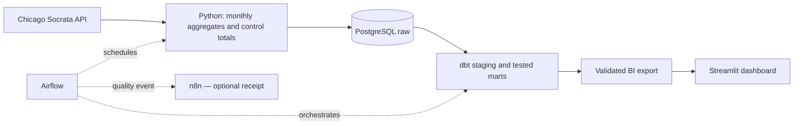

# Open Revenue Pipeline — Chicago Taxi Analytics

[Open the live dashboard](https://dossansan-open-revenue.streamlit.app/)
· [Verified PostgreSQL/dbt run](https://github.com/DossanSan/open-revenue-pipeline/actions/runs/35224315837)

A portfolio project using **real public API data** to demonstrate Python ingestion,
PostgreSQL loading, dbt modelling, Airflow orchestration, optional n8n integration,
and a Streamlit dashboard. No synthetic business data or personal trip records.

**Business question:** How did recorded taxi trip value change across 2024–2025,
and how do reported volume, average trip value and payment mix relate to that change?

This is revenue-oriented analytics, not SaaS subscription analytics. The source does
not support NRR, churn, CAC or LTV. Recorded trip value is not settled/net revenue.



## Delivery status

- Implemented: extraction, validation, atomic snapshots, transactional PostgreSQL
  loader with SELECT preview, dbt models/tests, Airflow DAG, n8n workflow, Docker
  configuration, Streamlit dashboard and optional Power Query/DAX source.
- Verified locally: see `docs/verification.md` for actual evidence and limitations.
- Passed in [GitHub Actions](https://github.com/DossanSan/open-revenue-pipeline/actions/runs/35224315837):
  PostgreSQL load/rerun, dbt build/tests and publication of the dashboard export.
- Published: [GitHub repository](https://github.com/DossanSan/open-revenue-pipeline).
- Published: [Streamlit dashboard](https://dossansan-open-revenue.streamlit.app/),
  using the verified dbt export. Three pages and interactive filters are available.
- Pending: Airflow/n8n runtime checks; their configuration is included but is not
  evidence of an executed production deployment.
- **Not a production deployment:** Airflow standalone is a local learning setup.

## Source and scope

[City of Chicago — Taxi Trips (2024-)](https://data.cityofchicago.org/Transportation/Taxi-Trips-2024-/ajtu-isnz)
through the [Socrata API](https://data.cityofchicago.org/resource/ajtu-isnz.json).
Window: **2024-01-01 inclusive to 2026-01-01 exclusive**, local calendar time.
One row: **month x payment type**. USD. Server-side aggregates avoid downloading
millions of trip rows. [Metric definitions and limitations](docs/data_contract.md).

## 1. Run extraction without Docker

Python 3.10+; extractor and unit tests use only the standard library.
Run commands from this project directory, not its parent workspace.

```bash
python3 -m unittest discover -s tests -v
python3 -m pipeline.extract --start 2024-01-01 --end 2024-02-01
```

For the full portfolio window:

```bash
python3 -m pipeline.extract --start 2024-01-01 --end 2026-01-01
```

Output: `data/snapshot.json` with a manifest, checksum, control totals and records.
Queries are sequential and month-bounded, with timeouts and exponential retry.
If Python on macOS lacks its CA certificates, configure a trusted CA file, e.g.
`SSL_CERT_FILE=/etc/ssl/cert.pem` where that system bundle exists. Never disable TLS.

## 2. Start the local stack

Prerequisite: Docker with Compose. Generate an ephemeral local development password
in your shell; it is not printed or written to the repository:

```bash
export PGPASSWORD="$(python3 -c 'import secrets; print(secrets.token_urlsafe(32))')"
docker compose up --build -d
```

Keep that environment available for later commands; an existing PostgreSQL volume
retains its original password. Do not regenerate it against an existing volume.
Airflow UI: http://localhost:8080. Use the local standalone login shown by your
installation; do not share its credentials or commit state/logs.

Run each component manually first:

```bash
docker compose exec airflow /opt/pipeline-venv/bin/python -m pipeline.load
docker compose exec airflow /opt/pipeline-venv/bin/python -m pipeline.load --apply
docker compose exec airflow /opt/pipeline-venv/bin/dbt build --project-dir dbt --profiles-dir dbt
docker compose exec airflow /opt/pipeline-venv/bin/python -m pipeline.export
```

The first command is read-only. The second creates the project schema/table if
needed and atomically replaces only the validated interval. Source APIs are read-only.

Then trigger `open_revenue_pipeline` in Airflow. It runs extract → preview/load →
dbt build → export → optional n8n receipt. `max_active_runs=1` protects the shared
snapshot path; do not run a competing manual extraction during a DAG run.

The monthly schedule refreshes the fixed historical window; it does not silently
advance into incomplete months. Dates can be changed explicitly in DAG parameters.

## 3. Optional n8n exercise

```bash
docker compose --profile automation up -d n8n
```

Open http://localhost:5678, complete local setup, import `n8n/quality_event.json`,
and activate/publish the workflow. Set `N8N_WEBHOOK_URL` in the shell to
`http://n8n:5678/webhook/revenue-quality`, then recreate the Airflow service.
The workflow validates an internal receipt only. It sends no email/Slack messages.
It is intentionally small: the data pipeline does not require a second scheduler.

## 4. Streamlit and publication

Follow [Streamlit setup](dashboard/README.md). It works on macOS, Linux and Windows.
The app initially uses `public/api_snapshot.json` with an explicit API-preview label.
After dbt tests pass, export `public/dashboard.json` for the full pipeline view.
The manual GitHub Actions workflow **Build and publish validated mart** runs PostgreSQL
and dbt remotely, verifies repeat loading and commits only the public aggregate result.
This avoids needing Docker on the dashboard host or on a Mac for the first full build.

Streamlit Community Cloud can host the app for free using this repository and
`dashboard/app.py`. Cloud deployment/account authorization is still a separate step.
The original optional [Power BI source](powerbi/README.md) is retained as an alternative;
it is not a completed PBIX report and is no longer the primary deliverable.

GitHub publication must use this folder as the repository root, excluding all
unrelated parent-workspace files. Temporary snapshots, secrets, runtime state and
binary report caches are ignored. Only reviewed aggregate snapshots in `public/`
are published. Include a source attribution and a public report
link only after verifying it in a signed-out browser.


## Engineering decisions

- Month-bounded aggregate pushdown keeps extraction small and avoids personal data.
- Monetary values use Decimal/numeric, not binary floating-point arithmetic.
- Source totals are independently queried; partial snapshots never replace good files.
- A checksum guards load inputs; interval replacement handles source revisions.
- dbt tests gate export; ratios use weighted totals, not means of averages.
- Fixed history is re-readable; snapshot timestamps/checksums provide provenance.
- The local stack is deliberately simpler than a hardened production deployment.
